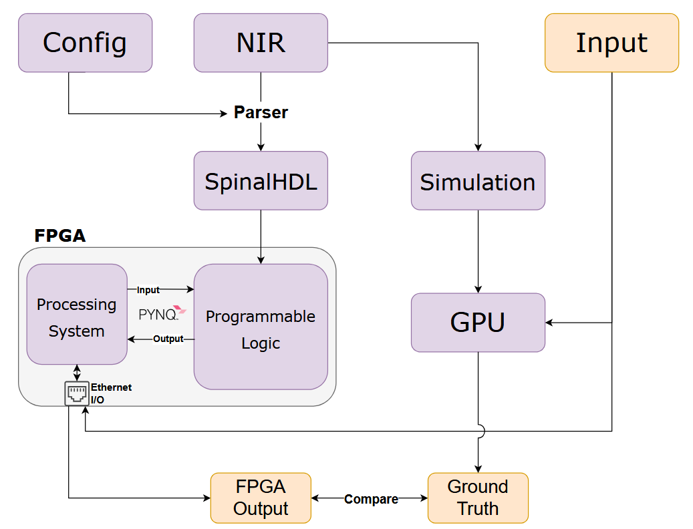
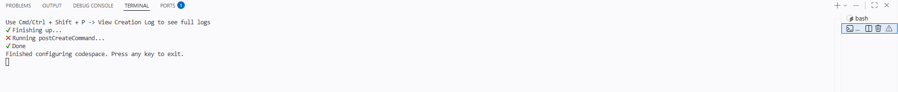

# NIR2FPGA: A Spiking Neural Network → FPGA Compilation Toolchain



NIR2FPGA compiles Spiking Neural Networks (SNNs) expressed in
[NIR (Neuromorphic Intermediate Representation)](https://nnir.readthedocs.io/)
into RTL that runs on Xilinx FPGAs. This repository is the hands-on companion
for the **ISCAS 2026 tutorial**: in a couple of hours you will train a small
SNN in PyTorch/JAX, export it to NIR, quantize it, compile it to SpinalHDL,
and simulate the generated hardware against your reference outputs.

## What you will learn

- How to describe a spiking neuron and export it as NIR
- How fixed-point quantization affects neuron dynamics
- How NIR primitives (I, LI, LIF, Affine, ...) map to hardware
- How to read the generated SpinalHDL and add a new primitive yourself

**Prerequisites:** comfort with Python and basic neural networks. No FPGA
experience required — we run only simulation in this tutorial; bitstream
generation and on-board inference are presented as a demo.

---

# Environment setup

A VS Code Dev Container environment is provided. You can run it on the cloud
via GitHub Codespaces or locally.

## GitHub Codespaces (no local installation required)

This repository has a **prebuild configuration** set up — the environment is
built in the background ahead of time so you can start coding immediately
without waiting for packages to install.

> **Important:**
> To benefit from the prebuild, open the Codespace directly from this
> repository (not a fork). Launch with a 4-core machine.

1. Click **Code (green button) → Codespaces** on this public repo
2. Click the **three dots (···)** and select **New with options…**
3. Under **Machine type**, select **4-core**
4. Click **Create codespace**

A VS Code editor opens in your browser — it will take the environment
around 5–10 minutes to set up the required imports.

> **Tip:** To view the creation log during the build, open the Command
> Palette (`Ctrl+Shift+P` / `Cmd+Shift+P` on Mac) and run
> **Codespaces: View Creation Log**.

During the setup you may see this screen in the terminal:



**Do not press any key when you see this.** The `devenv shell` is still
running in the background. If you accidentally press a key, just run
`devenv shell` again in the new bash terminal and it will resume normally.

To reopen a stopped codespace: **Code → Codespaces → your codespace name**
(shown on the bottom left in the blue rectangle).

> **Note:** GitHub Free accounts include 60 core-hours and 15 GB storage
> per month. A 4-core codespace uses 2 hours of quota per hour of runtime,
> so **stop your codespace when you take a break**. Education accounts get
> more quota.

## Verifying the environment

After the container starts, open a terminal (**Terminal → New Terminal** or
`` Ctrl+` ``) and run:

```bash
devenv shell
```

This takes ~2 minutes the first time. Then verify the Python pipeline runs:

```bash
python iscas26-tutorial/neuron/1-definition.py
```

If that prints a training loop and exits cleanly, you are ready to go.

---

# Tutorial flow

Work through the notebooks in this order. The Dev Container auto-opens the
first two for you.

| # | Notebook | What you do | Time |
|---|----------|-------------|------|
| 1 | [`iscas26-tutorial/neuron/1-definition.ipynb`](iscas26-tutorial/neuron/1-definition.ipynb) | Define a single LIF neuron in [Spyx](https://github.com/kmheckel/spyx), train a tiny classifier, export to NIR. | ~25 min |
| 2 | [`iscas26-tutorial/neuron/2-n2f.ipynb`](iscas26-tutorial/neuron/2-n2f.ipynb) | Quantize the NIR graph, compile it to SpinalHDL via `sbt`, and compare the hardware simulation against the JAX reference. | ~30 min |
| 3 | [`iscas26-tutorial/mnist/1-mnist.ipynb`](iscas26-tutorial/mnist/1-mnist.ipynb) *(optional)* | Train a 2-layer SNN on MNIST in [Norse](https://github.com/norse/norse), export to NIR, repeat the compile-and-compare loop on a non-trivial model. | ~25 min |
| 4 | [`iscas26-tutorial/docs/primitive-evolution.org`](iscas26-tutorial/docs/primitive-evolution.org) *(live-coding)* | Implement the LIF primitive in SpinalHDL yourself. Walk through the I → LI → LIF progression using the `demo` / `main` / `solution` branches. | ~40 min |

The `main` branch ships with the **I** and **LI** primitives implemented; you
add **LIF**. The `solution` branch has the reference implementation if you get
stuck.

---

# Pipeline overview

The toolchain has four stages. **Stages 1 and 2 are the hands-on part of the
tutorial.** Stages 3 and 4 are presented as a demo during the session.

### Stage 1 — Discretization & quantization (Python)

Takes a floating-point NIR graph, normalizes neuron parameters (e.g. rescales
Norse `tau_mem` for the discrete time base), and applies fixed-point
quantization (default 16-bit total, MinMax PTQ). Emits `model.nir` plus a
`model.json` containing pre-encoded AXI4-Stream input packets and the
reference recordings used downstream for output verification.

### Stage 2 — Compilation (Scala / SpinalHDL)

Parses the quantized NIR graph and instantiates a hardware accelerator: one
SpinalHDL module per NIR primitive, wired together by an on-chip router that
forwards 32-bit AXI packets. Runs the generated RTL in Verilator and compares
its outputs to the Stage-1 recordings.

### Stage 3 — Vivado bitstream *(demo only)*

Synthesizes the generated Verilog into a Zynq bitstream. Requires Vivado and
roughly an hour of build time, so it is not run live in the tutorial — we
show a prebuilt bitstream.

### Stage 4 — PYNQ inference *(demo only)*

Loads the bitstream onto a PYNQ board, streams events from the host, and
collects the FPGA's spike outputs. We demonstrate this with a recorded run.

---

# Troubleshooting

### Python interpreter not found

If imports show missing packages after the container starts:

1. Open the Command Palette (`Ctrl+Shift+P` / `Cmd+Shift+P`)
2. Run **Python: Select Interpreter**
3. Choose `.devenv/state/venv/bin/python`

### Environment still broken after rebuild

Try a clean rebuild: **Codespaces: Rebuild Container** from the Command Palette.

### `sbt` is slow on the first invocation

The first `sbt` command takes ~30 s while it downloads dependencies; later
invocations are ~5 s. Please be patient.

---

# Local development

If you would rather run the tutorial on your own machine instead of in
Codespaces:

1. Install [devenv](https://devenv.sh/getting-started/) (Nix-based).
2. Clone with submodules:
   ```bash
   git clone --recurse-submodules <repo-url>
   # or if you already cloned:
   git submodule update --init --recursive
   ```
3. Enter the environment:
   ```bash
   devenv shell
   ```
4. For end-to-end accelerator tests, run `sbt runMain NIR2FPGA.AcceleratorSim`
   from `2-compilation/`.

---

# Canonical quantization benchmark

Use `spiker-mnist` as the canonical PTQ benchmark:

```bash
devenv shell -- python 1-discretization-quantization/scripts/benchmark_spiker_mnist.py --bits 8 --calibration-samples 1024
```

QAT setup / hardware-compatibility check:

```bash
devenv shell -- python 1-discretization-quantization/scripts/qat_spiker_mnist.py --epochs 1 --train-samples 256 --eval-samples 64 --calibration-samples 256 --bits 8
```

---

# Further reading

- **NIR**: [Pedersen *et al.*, *Neuromorphic Intermediate Representation*, 2024](https://www.nature.com/articles/s41467-024-52259-9) and https://neuroir.org
- **Norse**: <https://github.com/norse/norse>
- **Spyx**: <https://github.com/kmheckel/spyx>
- **SpinalHDL**: <https://spinalhdl.github.io/SpinalDoc-RTD/>
- **PYNQ**: <http://www.pynq.io/>
